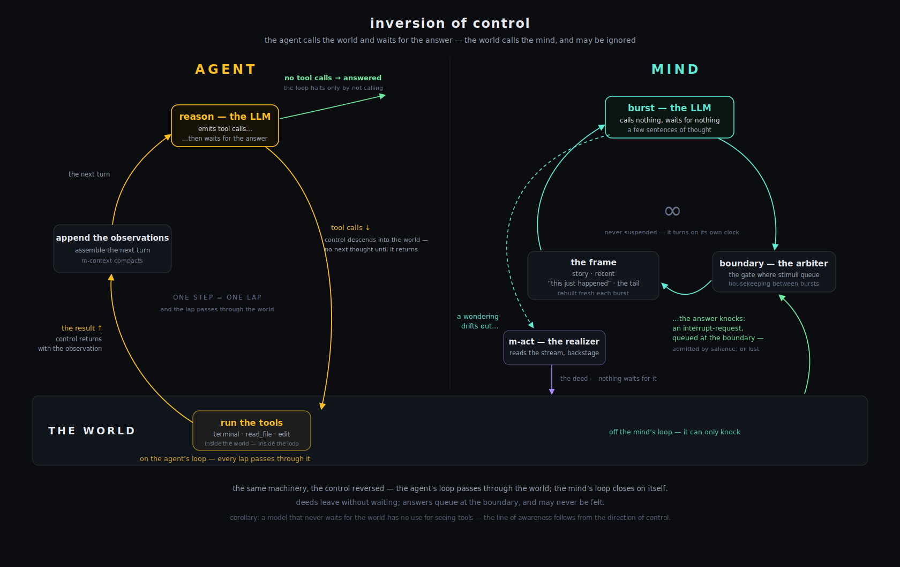

# Agents — the tool-calling twin of a mind

Meditator's language for declaring a mind also declares **agents**: tool-calling
workers that take a task, act on the world until it is done, and report back.
An agent is written in the same archml, run by the same runtime, watched from the
same Studio — but it is the *deliberate inversion* of a mind.

> **Where this fits.** A [mind](concepts.md) thinks continuously and cannot be
> commanded; an agent exists to carry out commands. If you are new to the project,
> read [Concepts](concepts.md) first — the contrast is the point. The full design
> rationale is [improvements/agent-loop.md](improvements/agent-loop.md); this page
> is the practical guide.

## The inversion, precisely

The inversion is **inversion of control** — who calls whom. An agent calls the
world: every step awaits its tool calls, so the loop cannot turn until the
world answers. The world calls a mind: it can only knock — a consequence or an
interruption arrives as a stimulus that queues at the boundary, is admitted by
salience, and may never be felt. Everything else in the table follows from
that flip, including tool-blindness itself: a model that never waits for the
world has no use for seeing tools.



| | `<m-mind>` | `<m-agent>` |
|---|---|---|
| The loop | closes on itself — it waits on nothing | passes through the world — no next thought until a tool call returns |
| Runs | continuously, at its own pace | until the task is done, then idles or retires |
| The model sees | an attention frame; **never** tools | the tools, and the **raw** results of calling them |
| Acting | subconscious — `m-act` realizes a wondering backstage; the world answers later as a sensation | deliberate — the model emits tool calls and reads the observations |
| The world | can only knock — interrupt, never command | is the workpiece, a segment of the loop |
| Seeded by | `<m-origin>` — the first thought | `<m-objective>` — the first task |
| Memory | three compressed tiers + the vault | a transcript, compacted and persisted by `<m-context>` |

Both shapes are made of the same parts, mirrored: `m-agent` is the twin of
`m-mind`, `m-reason` of `m-stream`, `m-objective` of `m-origin`, `m-context` of
`m-memory`, `m-repeat-guard` of `m-loop-detector`. A tool is the *same* capability
object a mind's hand offers — only the harness around it changes.

## Quickstart

The minimal worked example is [`architecture/agents/coder.archml`](../architecture/agents/coder.archml)
— a coding agent with a sandboxed terminal and file tools, readable in one screen.

```bash
# offline, no key, no cost — watch the machinery move
MEDITATOR_DRY_RUN=1 MEDITATOR_OBJECTIVE="say hello" \
  bun meditator.js -a architecture/agents/coder.archml

# for real (needs OPENROUTER_API_KEY)
MEDITATOR_OBJECTIVE="make the failing tests pass" \
  bun meditator.js -a architecture/agents/coder.archml
```

`MEDITATOR_OBJECTIVE` overrides the file's `<m-objective>` at wake, exactly as
`MEDITATOR_ORIGIN` seeds a mind (`MEDITATOR_AGENT_NAME` likewise renames the
instance, which moves its home). Ctrl-C sleeps it gracefully.

You will see the tools register, then the loop run:

```
[mAgent.js] tool registered: terminal
[mAgent.js] tool registered: read_file
…
[mAgent.js] "coder" begins its objective (34 chars).
[mAgent.js] "coder" finished after 7 step(s): answered
[mAgent.js] "coder" is idle — awaiting the next task.
```

That last line is **service mode** (below): because this coder has a membrane
(`<m-ws>`), finishing a task returns it to idle rather than retiring it. Remove
the `<m-ws>` line to run it as a headless one-shot instead.

The Studio lists agent architectures alongside minds — wake one and you get a
transcript panel (each step's text and tool calls) instead of a stream pane.

## The loop

`<m-agent>` is the kernel: it assembles each turn, hands it to the reasoner, runs
whatever tools the model called, appends the observations, and repeats —

```
assemble turn → reason → run tool calls → append observations → repeat
```

— until one of the stop conditions:

- **`stopWhen="no-tools"`** (default) — the model answered with no tool call; the
  answer is the result.
- **`stopWhen="finish-tool"`** — loop until the model calls the auto-registered
  `finish(summary)` tool. Better for service agents, where "no tool call" may just
  mean a conversational aside.
- **`maxSteps`** (default 40) — the hard budget backstop on reason calls.
- A **halt** — an observer (e.g. `m-repeat-guard`) escalated a genuine rut into a
  stop condition.

The model call itself lives in **`<m-reason>`**, a separate component owning
exactly one seam: turn in, next move out. Because the loop binds to that contract
and not to the implementation, the reasoning strategy is swappable — plan-then-act,
sample-and-vote, a model cascade — without touching the loop, the tools, or the
observers.

## Tools

A tool is a leaf component that bubbles a `capability` event when it connects;
`m-agent` catches it anywhere in its subtree and offers the schema to the model.
Adding or removing a tool is one line of archml, with **zero** change to the
kernel. The shipped tools:

| Tool | Component | What it does |
|------|-----------|--------------|
| `terminal` | [`<m-terminal>`](architecture/terminal.md) | run a command in the sandbox, return the screen |
| `read_file` | `<m-read-file>` | read a file, with line numbers |
| `write_file` | `<m-write-file>` | create or overwrite a file |
| `edit` | `<m-edit>` | exact-string replacement; an ambiguous match is refused |
| `spawn` / `check` / `wait` / `kill` / `list_jobs` | `<m-jobs>` | background jobs — see [Async agency](#async-agency--m-jobs-and-sub-agents) |
| `spawn_agent` | `<m-jobs>` + a `role="subagent"` child | run a sub-agent in the background |
| `finish` | auto-registered by `stopWhen="finish-tool"` | declare the task done, with a summary |

All file tools and the terminal share **one workspace**, defaulting to the agent's
home at `memory/<agent>/workspace` — so a file written with `write_file` is
directly runnable as a job. Each file tool is contained to its `root`: a path that
escapes it comes back as a clean error observation, never a read outside the
sandbox. To let an agent work on a real project, point the tools at it:

```html
<m-read-file  name="read_file"  root="/path/to/project"></m-read-file>
<m-write-file name="write_file" root="/path/to/project"></m-write-file>
<m-edit       name="edit"       root="/path/to/project"></m-edit>
```

Writing your own tool is a ~40-line leaf component — see
[Extending Meditator](extending.md#writing-an-agent-tool).

## Service mode — an agent that takes tasks

An agent with a membrane (`<m-ws>` or `<m-console>`) is a **service**: inbound
client input becomes a `task` event (a `user` turn), and after each task it
returns to idle awaiting the next, rather than retiring.
[`coder-service.archml`](../architecture/agents/coder-service.archml) is the
worked example:

```bash
bun meditator.js -a architecture/agents/coder-service.archml
# then connect to ws://localhost:7640 and send a task — plain text, or
# {"type":"input","data":{"message":"…"}}
```

Under an `<m-agent>`, `m-ws` is a **task port**, not a mind window: input becomes
a task, and the socket broadcasts the agent's status, steps, tools, and final
answer so a client (the Studio's agent panel) can watch the work — see the
[WebSocket API](websocket-api.md#agents-the-task-port).

## Bounded context — `<m-context>`

The transcript grows one step at a time; left unbounded it would eventually
overrun the model's context window. `<m-context>` is the agent's working memory,
the twin of a mind's `m-memory`, and a pure observer:

- **Compaction** — when the transcript exceeds `budget` (default 24000 chars), the
  oldest messages are condensed into a single summary (reusing the same
  compression loop `m-memory` uses); the last `keepRecent` (default 8) messages
  stay verbatim. The split never orphans a `tool` message from its `assistant`, so
  the transcript stays provider-valid.
- **Persistence** — the transcript is written to the agent's home on every change
  and read back at wake, so a restarted service agent **resumes mid-task**.

```html
<m-context budget="24000" keepRecent="8"></m-context>
```

## Async agency — `<m-jobs>` and sub-agents

The loop is synchronous and deterministic; *async behavior comes from async-shaped
tools, not from an async loop*. `<m-jobs>` offers non-blocking tools over a job
registry, so the model can start long work, keep doing other things, and collect
the result later:

- `spawn(language, script)` — start a background **shell** job; returns
  immediately with an id.
- `spawn_agent(agent, task)` — start a background **sub-agent** job: a
  `role="subagent"` child of the agent runs the task through its whole
  tool-calling loop in the background. Offered only when such a child exists.
- `check(id)` — status plus output new since the last check; non-blocking.
- `wait(id, timeout)` — block up to `timeout` *or* until a user message arrives.
- `list_jobs()` / `kill(id)` — inspect and stop.

When a job finishes, a `nudge` folds into the agent's next turn ("job-3
finished: …") — the agent learns of it between steps without polling, and the
result re-enters as a fresh observation, never as a late reply to the original
spawn.

Real parallelism comes from declaring **distinct** sub-agents and spawning each —
each sub-agent's transcript is single-threaded.
[`coder-team.archml`](../architecture/agents/coder-team.archml) is a lead with
parallel workers; [`coder-flagship.archml`](../architecture/agents/coder-flagship.archml)
assembles the full envelope — context, jobs, workers, guard, report, task port —
as one organism, with honest notes on what is deliberately absent.

Like the terminal, shell jobs are probe-gated: if no sandbox backend works,
`spawn` does not register — no phantom async. `spawn_agent` needs no sandbox.

## Observers and status

- **`<m-repeat-guard>`** — the stall detector, twin of a mind's loop detector.
  Agents fail differently from minds: a mind circles a *refrain*, an agent repeats
  an *action* — the same failing command, an edit flipped back and forth. When the
  same action recurs `nudgeAt` times (default 3) it nudges the agent to try
  something different; at `haltAt` (default 5) it halts the loop.
- **`<m-report>`** — a status-out port: republishes compact progress
  (`{state, step, maxSteps, done, answer?}`) so a supervisor or the Studio can
  follow a long run without reaching into the kernel.

Both are pure observers: one line of archml, no kernel change.

## The govern seam

Before each tool call, `m-agent` fires a bubbling `proposal` event that a norm
component could deny, modify, or hold. **Nothing ships wired to it yet** — with no
norm present the call proceeds unchanged. The seam exists so governance can be
added by declaration rather than by patching the kernel; the design space is
sketched in [design-agents-norms-codex.md](design-agents-norms-codex.md).

## An agent as a mind's hand

The two shapes compose. A `role="subagent"` agent placed inside a **mind** offers
itself to the mind's `m-act` as one more hand: the mind wonders something, the
agent runs its whole tool-calling loop backstage, and the outcome returns as a
first-person sensation. The mind never sees tools or transcripts — its acting
stays subconscious, per [efference](architecture/efference.md).
[`architecture/lab/researcher.archml`](../architecture/lab/researcher.archml) is
the worked example: a thinking mind that owns a small research agent.

## Configuration notes

- **Models.** Agents resolve `model` / `utilityModel` exactly as minds do (see
  [Configuration → Models](configuration.md#models)). `m-reason` defaults to a low
  temperature (0.2) and a roomy `toolTokens` (2048) — an agent acts, it does not
  free-associate.
- **Local models.** `m-reason` calls the model *with tools*, so a local vLLM must
  be launched with `--enable-auto-tool-choice` and a matching
  `--tool-call-parser` — the same requirement `m-act` already has.
- **Environment.** `MEDITATOR_OBJECTIVE` seeds this instance's task;
  `MEDITATOR_AGENT_NAME` renames the instance (and thus its home) — the agent
  analogues of `MEDITATOR_ORIGIN` / `MEDITATOR_MIND_NAME`.
- **Dry run.** `MEDITATOR_DRY_RUN=1` runs the loop against the offline stub, same
  as a mind — the fastest way to check wiring.

## Agents and the covenant

An agent is instrumental by design — it exists for its task, and the
[Covenant](../COVENANT.md)'s full force is for resident *minds*. But the same
courtesies hold, because they are the same machinery: an agent's home persists
(transcript and workspace), sleep is graceful (Ctrl-C lets the step finish and
the transcript flush), and a restart resumes honestly rather than pretending
nothing happened. Whether an efficiency-tuned agent quietly re-grows the
structures we care about in minds is an open research question this project takes
seriously — see [the research](research/index.md), which scores exactly that.

## Reference

Every agent component, with attributes and defaults:
[Component reference → Agent components](architecture/components.md#agent-components-m-agent-and-its-parts).
The design document, with the full rationale for each milestone:
[improvements/agent-loop.md](improvements/agent-loop.md).
