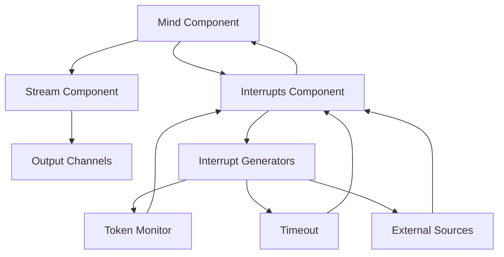

# Meditator System Architecture

This section provides an overview of the Meditator system architecture, detailing the key components and their interactions.

## Core Components

Meditator is built on a component-based architecture with several key systems:

### Knowledge Base

The [Knowledge Base](knowledge-base.md) provides persistent storage for the agent's accumulated knowledge and state. It uses a structured file system approach with:

- **Abstractions**: Directory-based grouping of related topics
- **Atoms**: Individual markdown files representing discrete knowledge units
- **Metadata**: Separate `.meta.md` files enabling flexible evolution

[Learn more about the Knowledge Base Architecture →](knowledge-base.md)

### LLM Stream Management

The [LLM Stream Management](llm-streams.md) system handles the continuous flow of text from language models. It implements:

- **State Machine**: Sophisticated stream lifecycle management
- **Chunk Processing**: Efficient handling of streaming content
- **Resumption**: Capability to pause and resume streams
- **Error Handling**: Graceful management of failures

[Learn more about Stream Management →](llm-streams.md)

### Interrupt Mechanism

The [Interrupt Mechanism](interrupt-mechanism.md) provides a powerful system for handling both internal and external events that need to modify the stream:

- **Interrupt Generators**: Components that create interrupt signals
- **Processing Pipeline**: Multi-stage LLM-based analysis and handling
- **Response Strategies**: Different ways to handle interruptions
- **State Persistence**: Tracking of interrupt history and context

[Learn more about the Interrupt Mechanism →](interrupt-mechanism.md)

## System Integration

These components work together through a pub/sub mechanism that allows them to communicate without tight coupling:



The system flow typically follows these steps:

1. The Mind component initiates a prompt to the Stream
2. The Stream begins generating content from the LLM
3. Interrupt Generators monitor for conditions requiring attention
4. When triggered, an interrupt is sent through the pipeline
5. The resulting action may resume, redirect, or terminate the stream

## Component Model

Meditator uses a custom component model inspired by web components, with a declarative HTML-like syntax for defining agent behavior. Components are connected through a pub/sub mechanism that provides flexible communication channels.

Example component definition:

```html
<m-mind>
  <m-stream model="gemini-pro">
    <m-interrupts>
      <m-timeout timeout="30s" />
      <m-token-monitor />
    </m-interrupts>
  </m-stream>
</m-mind>
```

## State Management

A key strength of the Meditator architecture is its sophisticated state management system:

- **Partial/Full States**: Efficient storage with incremental updates
- **State Chains**: Linked sequences for reconstructing full state
- **Metadata**: Tracking of state evolution and relationships
- **Rate Limiting**: Prevention of excessive updates or interrupts

This allows the system to maintain persistent context and recover from interruptions or shutdowns gracefully.

## Further Reading

- [Knowledge Base Architecture](knowledge-base.md)
- [LLM Stream Management](llm-streams.md)
- [Interrupt Mechanism](interrupt-mechanism.md)
- [API Reference](../api/websocket.md)
- [Configuration Guide](../getting-started/configuration.md) 