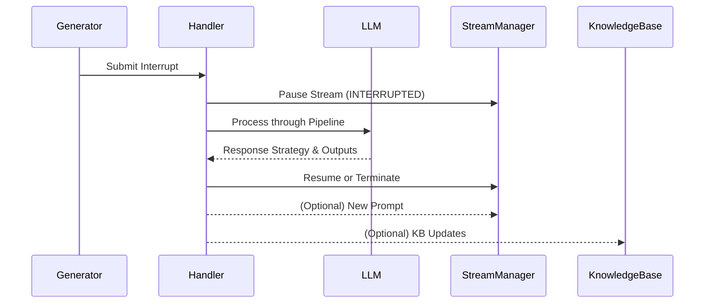

# Interrupt Mechanism

The Meditator system employs a sophisticated interrupt mechanism that handles interrupts to manage and control the continuous stream of consciousness. This document details the architecture and implementation of this system.

## Overview

The interrupt mechanism consists of two main components:
1. **Interrupt Generators** - Customizable tasks that can create interrupts based on various conditions
2. **Interrupt Handler** - A central system that processes interrupts through an LLM pipeline

## Interrupt Generators

Interrupt generators are separate tasks that can be customized and implemented by users. They operate independently and can be scheduled to run on various conditions.

### Interrupt Generator Types

Users can implement various types of generators:

1. **Token-Based Generators** (`mTokenMonitor`)
   - Run after every generated token
   - Can analyze the token stream using rules or LLM analysis
   - Detect patterns like repetition, digression, or specific keywords
   - Useful for content monitoring or validation

2. **Time-Based Generators** (`mTimeout`)
   - Run on fixed intervals (e.g., every 10 seconds)
   - Support randomized timing with normal distribution (sigma parameter)
   - Can perform periodic checks or updates
   - Useful for simulating random thoughts or scheduled maintenance tasks

3. **External Sources**
   - Direct messages or commands (from console)
   - Web interface interactions
   - API calls

## Interrupt Structure

Each interrupt is represented as a structured `InterruptRecord` object in code and as a Markdown document when transmitted between components:

```markdown
## Interrupt Record
- DateTime: [ISO 8601 timestamp]
- Source: [Source type]
- Type: [Specific interrupt type]
- Context:
  - Last Output: [Recent tokens from stream]
  - Stream State: [Current stream state]
- Reason: [Detailed explanation]
- Additional Data: [Any relevant metadata]
```

## Stream States

The stream component (`mStream`) implements a state machine with the following states:

- **IDLE**: Initial state before streaming begins
- **STARTING**: Preparing to start streaming
- **STREAMING**: Actively generating content
- **INTERRUPTED**: Stream paused by an interrupt (can be resumed or terminated)
- **COMPLETED**: Stream finished normally
- **ERROR**: Stream encountered an error

## Interrupt Handler Pipeline

The central interrupt handler (`mInterrupts`) processes all interrupts through a multi-stage LLM pipeline:



### Handler Processing Steps

1. **Reception Stage**
   - Receive and validate interrupt record structure
   - Enhance with additional metadata
   - Prepare for analysis

2. **Analysis Stage**
   - Process interrupt through first LLM analysis
   - Determine priority, relevance, and contextual needs
   - Evaluate if new prompt or KB updates are needed
   - Assess if stream should be resumed or terminated

3. **Planning Stage**
   - Determine response strategy using LLM
   - Response strategies are simplified to:
     - RESUME: Resume current stream
     - TERMINATE: End the current stream
   - Generate new prompt if needed
   - Prepare knowledge base updates if needed

4. **Execution Stage**
   - Execute the chosen strategy (resume or terminate)
   - Publish new prompt if generated
   - Publish knowledge base updates if required

## Handler Outputs

The interrupt handling pipeline can produce three types of outputs:

1. **Stream Command**
   - resume: Resume the current stream from where it was interrupted
   - terminate: Terminate the current stream completely

2. **New Prompt**
   - Optional output when a new prompt is needed
   - Can be published even when terminating the current stream
   - Will be processed by the Mind component to start a new stream

3. **Knowledge Base Updates**
   - Optional updates to the knowledge base
   - Can contain structured information to be stored

## State Management

Each interrupt generator maintains its own private state with a partial/full state chain system:

```
/interrupt-state/
├── token-monitor/
│   ├── state.md
│   └── state.meta.md
├── time-based/
│   ├── state.md
│   └── state.meta.md
└── custom-generator/
    ├── state.md
    └── state.meta.md
```

## Rate Limiting and Queue Management

The interrupt handler implements:
- Rate limiting to prevent too-frequent interruptions
- Priority handling for urgent interrupts
- A queue system for processing multiple interrupts sequentially
- State persistence to track interrupts and strategies over time

## Interrupt Processing

The interrupt system follows a 4-stage pipeline for processing interrupts:

### Stream State Transitions

Depending on the interrupt source and analysis, streams transition between states:

- **STREAMING**: Normal operation, actively generating content
- **INTERRUPTED**: Stream paused by an interrupt (can be resumed or terminated)
