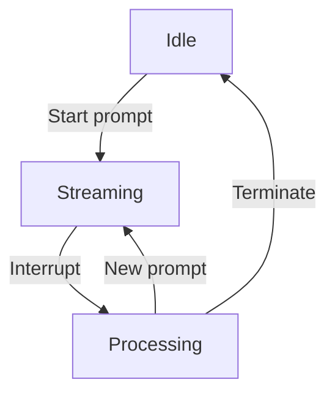

# LLM Stream Management

## Stream States

## Interruption Flow

1. Receive external event (user input, API call)
2. Freeze current stream context
3. Execute priority LLM pipeline:
   - Determine response strategy
   - Update knowledge base
   - Generate new prompt
4. Resume stream with new context
