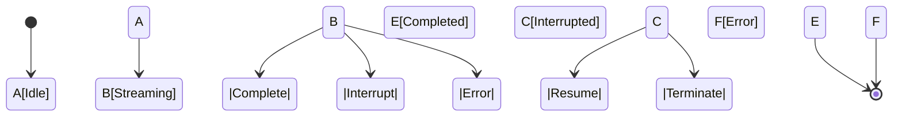

# LLM Stream Management

This document details how the Meditator system manages continuous LLM streams, handles interruptions, and maintains state across stream sessions.

## Stream States

The `mStream` component implements a state machine that governs the stream lifecycle:

## Stream State Machine

The stream implements the following state transitions:

- **IDLE**: Initial state before processing begins
- **STARTING**: Stream is being created but hasn't begun processing
- **STREAMING**: Actively processing and producing text
- **INTERRUPTED**: Stream is paused by an interrupt and pending resolution
- **COMPLETED**: Successfully processed all content
- **ERROR**: An error occurred during processing

## Stream Components

The streaming system consists of several key components:

- **`mStream`**: Core component responsible for managing the LLM stream
- **`mMind`**: Parent component that handles prompts and interrupts
- **`mInterrupts`**: Processes interrupt events through a multi-stage pipeline
- **`mTokenMonitor`**: Monitors token output for patterns requiring interruption
- **`mTimeout`**: Generates time-based interrupts

## Streaming Flow

1. **Initialization**
   - Mind component starts with initial prompt
   - Stream transitions to STARTING state
   - Creates connection to LLM streaming endpoint

2. **Content Generation**
   - Processes tokens as they arrive from the LLM
   - Publishes each chunk to subscribers
   - Maintains history of generated chunks
   - Transitions to STREAMING state

3. **Interruption Handling**
   - When an interrupt occurs, stream transitions to INTERRUPTED state
   - Current stream context is saved if resumable attribute is true
   - Interrupt handler processes the interrupt
   - Handler determines whether to resume or terminate the stream
   - Handler can generate new prompts and knowledge base updates

4. **Resolution**
   - Stream can receive resume command to continue from where it left off
   - Stream can receive terminate command to end processing
   - New prompts are processed separately and can start a new stream

## Chunk Processing

The stream system processes content in discrete chunks:

1. **Chunk Reception**: Receives delta content from LLM API
2. **History Management**: Adds to chunk history buffer
3. **Publication**: Publishes chunk to subscribers
4. **Output**: Writes to console or other output targets

## Integration with Interrupt System

Streams and interrupts are tightly integrated:

- Stream state is included in interrupt context
- Recent output is captured for interrupt processing
- Interrupt handler processes interrupts through a multi-stage pipeline:
  1. **Reception**: Validate and enhance interrupt data
  2. **Analysis**: Analyze interrupt content and context
  3. **Planning**: Determine if stream should resume or terminate
  4. **Execution**: Execute the chosen strategy

## Interrupt Handler Outputs

The interrupt handler can produce three types of outputs:

1. **Resume/Terminate Command**: Decides whether to resume or terminate the stream
2. **New Prompt**: Optional new prompt if a new stream should be started
3. **Knowledge Base Updates**: Optional updates to be applied to the knowledge base

## Configuration

Stream behavior can be configured via attributes:
- **model**: The LLM model to use for streaming
- **resumable**: Whether interrupts should be resumable

## Error Handling

The stream system implements robust error handling:
- Gracefully manages aborted streams
- Distinguishes between intentional aborts and errors
- Preserves state when possible
- Falls back to safe defaults when necessary
