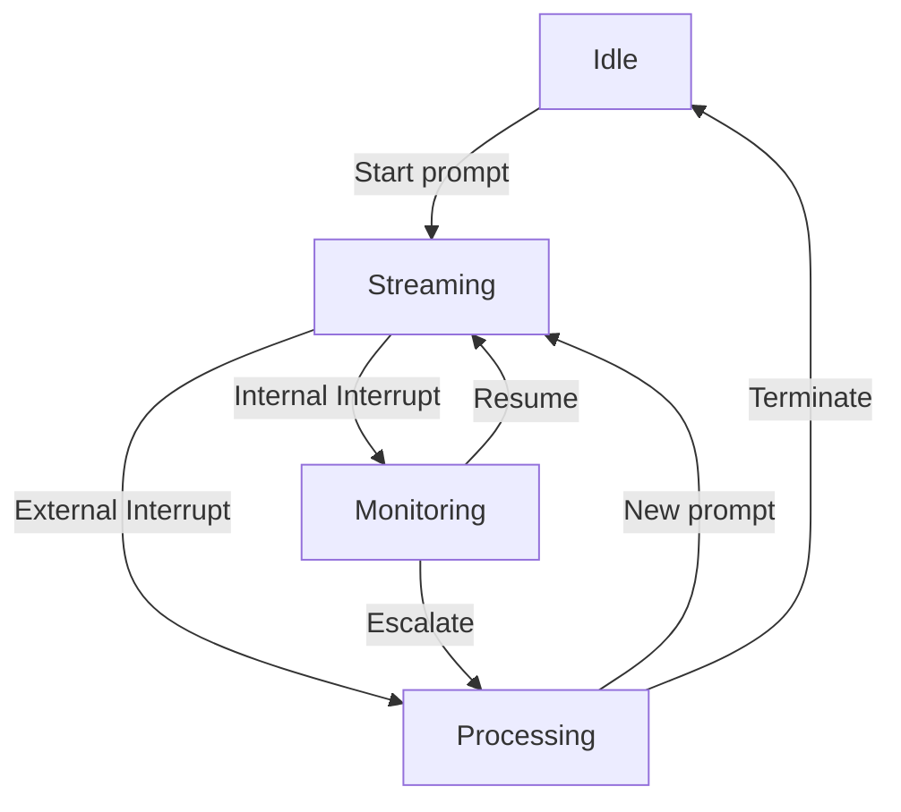

# LLM Stream Management

## Stream States

## Interruption Flow

1. **Generator Activity**
   - External events trigger interrupts
   - Internal generators monitor and create interrupts
   - Interrupts queued for handler

2. **Stream Management**
   - Handler freezes current stream context
   - Save state and metadata
   - Begin LLM pipeline processing

3. **Handler Processing**
   - Execute interrupt-specific LLM pipeline
   - Determine response strategy
   - Update knowledge bases
   - Generate new prompts if needed

4. **Stream Resolution**
   - Resume with new context
   - Redirect to new stream
   - Terminate if necessary

## Integration Points

- Interrupt Generators
- Central Handler
- Stream Controllers
- LLM Processors
