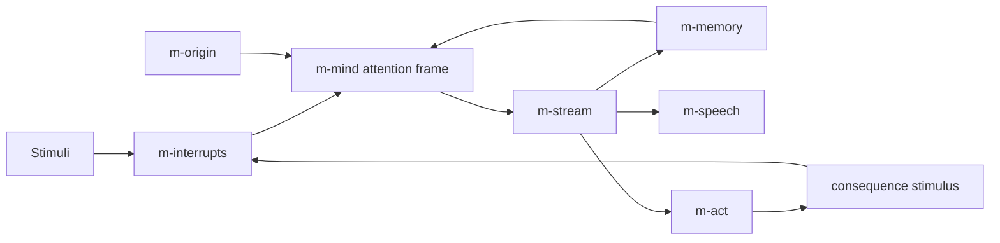
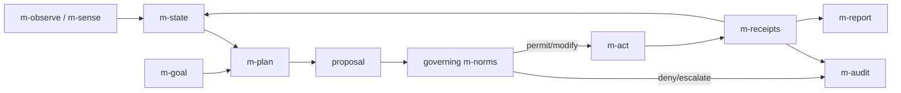
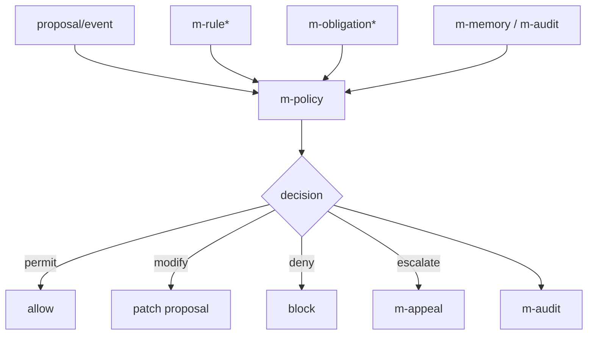
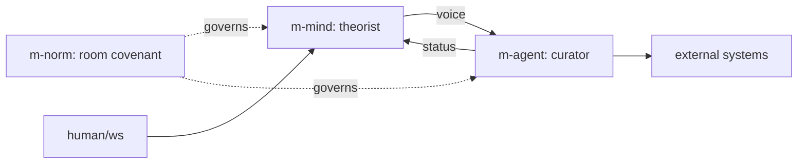

# Beyond Minds: Agents, Norms, and a Generic Architecture Interface

## Summary

Meditator should evolve from "a runner for `<m-mind>`" into "a runner for
autonomous entities described in ArchML." The existing `<m-mind>` element should
remain valid and should continue to mean exactly what it means today: an inward,
thought-oriented entity with an identity, an origin, memory, attention, stream,
and optional senses, voice, and hands.

The generic layer should not erase that meaning. Instead, it should make the
shared substrate explicit:

- an **entity** is a named, persistent, component-composed node with a membrane;
- a **mind** is an entity whose primary loop is inward thought;
- an **agent** is an entity whose primary loop is outward action;
- a **norm** is an entity or layer whose primary loop is governance: it evaluates,
  constrains, permits, vetoes, redirects, records, or escalates behavior.

The top-level syntax should therefore support parallel first-class roots:

```xml
<m-mind>...</m-mind>
<m-agent>...</m-agent>
<m-norm>...</m-norm>
<m-society>...</m-society>
```

Internally, these roots should share a common runtime contract, but their tags
should stay semantically distinct. `<m-entity kind="mind">` can exist as generic
sugar later, but it should not replace `<m-mind>`, `<m-agent>`, and `<m-norm>` as
the public vocabulary.

## Design Goals

1. Preserve every existing `.archml` file. A file rooted at `<m-mind>` should
   load without edits and behave as it does today.
2. Make Agents and Norms first-class, not comments wrapped around Minds.
3. Reuse the existing component model: custom elements, Amanita pub/sub topics,
   bubbling events, relative refs, inherited `model`/`utilityModel`, and named
   slots.
4. Keep membranes explicit. Cross-entity coupling should happen through ports,
   links, policies, and declared bindings, not by reaching into another entity's
   private interior.
5. Let Norms be both declarative policy layers and living entities when needed.
6. Support composition: Minds can own Agents as hands; Agents can consult Minds;
   Norms can govern either; societies can contain all three.

## The Top-Level Abstraction

### Recommendation: parallel public roots over one generic root

The most important design choice is whether to rename `<m-mind>` to a generic
root such as `<m-entity>`. I recommend against making the generic tag the main
interface. Use parallel public roots:

```xml
<m-mind name="lemma">...</m-mind>
<m-agent name="curator">...</m-agent>
<m-norm name="research-covenant">...</m-norm>
```

The runtime may implement these with a shared base class:

```text
MEntityKernel
├─ MMind    -> <m-mind>
├─ MAgent   -> <m-agent>
└─ MNorm    -> <m-norm>
```

This keeps the language honest. A Mind, an Agent, and a Norm are not just the
same thing with different labels. They have different default loops, default
frame sections, default ports, and failure modes.

### Why not replace `<m-mind>` with `<m-entity>`?

`<m-entity>` is attractive because it says "this is a general composition
interface." But it also discards the strongest part of Meditator's language:
the top-level tag tells the reader what sort of being or structure the file
declares.

The current `<m-mind>` tag carries philosophical and operational meaning:
continuous thought, memory, attention, origin, sleep, waking, and selfhood.
An Agent is not merely a Mind with more tools. A Norm is not merely a Mind with
a stricter prompt. Flattening all three into one tag would force every reader to
inspect attributes before understanding the file.

### Where `<m-entity>` still helps

The generic layer should exist, but as an implementation contract and optional
advanced syntax:

```xml
<m-entity name="curator" kind="agent">
  ...
</m-entity>
```

This can be useful for generated ArchML, research experiments, or future entity
types. It should desugar to the same kernel used by the concrete roots. For
human-authored architecture, concrete roots should be preferred.

## Mind, Agent, Norm

### Mind

A Mind is an inward-facing autonomous entity. Its primary output is a stream of
thought. It acts only when an inner reach becomes strong enough to realize through
`<m-act>`.

Default posture:

- attends to stimuli;
- builds an attention frame;
- continues a private stream;
- remembers experience as autobiography;
- may speak or act, but is not primarily a task executor.

Canonical loop:

```text
stimulus -> attention -> frame -> stream -> memory -> next burst
                              \-> speech/act only if intention emerges
```

`<m-mind>` should remain the default inward thinker.

### Agent

An Agent is an outward-facing autonomous entity. Its primary output is action in
the world. It may think internally, but the loop is organized around goals,
observations, plans, decisions, effects, and accountability.

Default posture:

- observes external state;
- maintains goals, tasks, or service obligations;
- plans and selects actions;
- executes through capabilities;
- records effects and receipts;
- reports status through a membrane.

Canonical loop:

```text
observe -> assess -> plan/select -> govern -> act -> verify -> record -> next cycle
```

An Agent can have a private thought stream, but it should not be required to
produce continuous prose. Its through-line is operational state, not narrative
identity.

### Norm

A Norm is a first-class governance construct. It can be simple and declarative,
like a rule set, or living and autonomous, like a monitor that watches behavior
over time and revises enforcement posture.

Default posture:

- declares scope and authority;
- evaluates proposed actions or emitted content;
- permits, denies, modifies, delays, logs, or escalates;
- can publish obligations and violations;
- can govern Minds, Agents, Societies, or other Norms.

Canonical loop:

```text
proposal/event -> policy context -> evaluation -> decision -> consequence/audit
```

Norms should not be hidden inside prompts. Prompt text is advisory. A Norm is a
runtime participant with ports, state, and explicit binding.

## Shared Entity Kernel

All first-class roots should share a substrate that existing components already
hint at.

### Entity attributes

Common attributes:

| Attribute | Applies to | Meaning |
| --- | --- | --- |
| `name` | all roots | Stable entity name and address prefix. |
| `model` | all roots | Default model inherited by child components. |
| `utilityModel` | all roots | Default model for classifiers, summaries, policy checks. |
| `memory` | all roots | Optional explicit home or persistence namespace. |
| `stage` | all roots | Catalog or lifecycle hint, as used by existing architecture conventions. |
| `governedBy` | mind/agent/society/norm | Space-separated refs to Norms. |
| `ports` | all roots | Optional declaration of public membrane ports. |

### Entity membrane

Every first-class entity should have a named membrane. The existing multi-mind
design already points in this direction with voice, thought, ear, and links.
Generalize it:

```text
public membrane
├─ input ports       events into the entity, often interrupt/proposal/task
├─ output ports      events or retained topics, such as voice/status/decision
├─ governance ports  proposed action, policy decision, violation, audit
└─ lifecycle ports   waking, sleeping, heartbeat, health
```

The encapsulation rule should stay load-bearing:

> Inside an entity, use relative refs. To cross an entity membrane, use declared
> ports, links, or governance bindings.

### Common lifecycle

The entity kernel should provide common lifecycle hooks:

```text
connect -> load persistent state -> bind ports -> start loop -> sleep/shutdown
```

Each root specializes what "start loop" means:

- Mind: begin burst cadence.
- Agent: begin observation/action cadence or wait for tasks.
- Norm: begin policy service and optional monitoring cadence.

## Proposed Syntax Extensions

### `<m-agent>`

An Agent root declares an outward-facing entity.

```xml
<m-agent name="curator"
         model="voice"
         utilityModel="utility"
         pace="30s"
         governedBy="/norms/research-covenant">
  Agent identity and operating charter.

  <m-goal name="goal">Maintain a clean, useful research digest.</m-goal>
  <m-observe name="sources" every="5m">...</m-observe>
  <m-state name="state" persist="agent/curator/state"></m-state>
  <m-plan name="planner" every="2"></m-plan>
  <m-act name="hands">...</m-act>
  <m-report name="status" port="status"></m-report>
</m-agent>
```

`<m-agent>` should inherit much of `<m-mind>`'s environment behavior, but its
default frame should be operational:

```text
who/what I am
standing goals and obligations
current state
recent observations
open tasks
pending proposals
last effects and receipts
available body schema
```

Unlike a Mind, an Agent should not require `<m-stream>`. If present, `<m-stream>`
is private deliberation or narration. If absent, `<m-plan>` and `<m-act>` can
drive the cycle.

### `<m-norm>`

A Norm root declares a governance entity.

```xml
<m-norm name="research-covenant"
        mode="constraint"
        scope="actions memory speech"
        authority="veto"
        severity="high">
  Norm identity and rationale.

  <m-rule name="cite-sources" appliesTo="publish summarize">
    Claims about external sources must include provenance.
  </m-rule>

  <m-rule name="no-fabricated-receipts" appliesTo="act report">
    Do not report that an external action occurred unless an execution receipt exists.
  </m-rule>

  <m-policy name="evaluator" model="utility"></m-policy>
  <m-audit name="audit" persist="norms/research-covenant/audit"></m-audit>
</m-norm>
```

Norm attributes:

| Attribute | Default | Meaning |
| --- | --- | --- |
| `mode` | `constraint` | `constraint`, `template`, `monitor`, `living`, or `constitution`. |
| `scope` | `actions` | Space-separated surfaces governed: `actions`, `speech`, `memory`, `links`, `spawning`, `prompts`, `all`. |
| `authority` | `advise` | `advise`, `warn`, `require`, `veto`, `transform`, `escalate`. |
| `priority` | `0` | Ordering when several Norms apply; higher priority evaluates earlier. |
| `extends` | none | Norm inheritance or mixin composition. |
| `governedBy` | none | Meta-norms governing this Norm. |

### `<m-governed>`

Use an explicit component when a binding needs more than an attribute:

```xml
<m-governed by="/norms/research-covenant"
            surface="actions speech"
            onViolation="veto"
            audit="true"></m-governed>
```

This is useful inside a Mind or Agent when only part of the entity is governed,
or when the binding needs local configuration.

### `<m-proposal>` and governance flow

World-changing action should move through a proposal event before execution.
This does not require exposing tools to the conscious stream. It inserts a
governance checkpoint between `MAct`'s realization and capability execution.

Proposed shape:

```js
{
  id,
  actor: "/curator",
  surface: "actions",
  capability: "publish",
  args: {...},
  intent: "post a digest item",
  expectedEffect: "new public digest entry",
  receiptsRequired: true,
  at
}
```

Norm decision shape:

```js
{
  proposalId,
  norm: "/norms/research-covenant",
  decision: "permit" | "deny" | "modify" | "delay" | "warn" | "escalate",
  reason,
  patch,
  obligations: [],
  audit: true
}
```

### `<m-rule>`

`<m-rule>` is the smallest unit of declarative policy.

```xml
<m-rule name="rate-limit-publication"
        appliesTo="publish"
        decision="delay"
        cooldown="10m">
  Public posts from this agent must be at least ten minutes apart.
</m-rule>
```

Rules can be:

- pure text interpreted by `<m-policy>`;
- structured with attributes;
- backed by a custom JS component when deterministic enforcement is needed.

### `<m-policy>`

`<m-policy>` is the evaluator. It consumes rules, context, proposals, and events.

```xml
<m-policy name="evaluator"
          model="utility"
          decisionTokens="300"
          default="deny"
          explain="true"></m-policy>
```

For high-stakes constraints, policy should support deterministic rules before
LLM judgment:

```xml
<m-policy name="evaluator" strategy="deterministic-first" default="deny">
  <m-rule name="never-delete-memory" decision="deny" appliesTo="delete-memory"></m-rule>
  <m-rule name="ask-before-public-post" decision="escalate" appliesTo="publish"></m-rule>
</m-policy>
```

### `<m-audit>`

Norms need durable accountability separate from a governed Mind's autobiography.

```xml
<m-audit name="audit"
         persist="memory/norms/research-covenant/audit"
         retain="all"></m-audit>
```

It records proposals, decisions, violations, overrides, and appeals.

### `<m-obligation>`

Some Norm decisions do not only permit or deny. They create obligations:

```xml
<m-obligation name="cite-before-publish"
              due="before:publish"
              surface="speech actions">
  Any external claim in a public digest must carry a source URL or local note ref.
</m-obligation>
```

Obligations can be published as retained topics so Agents can plan around them.

### `<m-appeal>`

Governance should have an escape hatch for cases where a Norm should not silently
block the entity forever.

```xml
<m-appeal name="human-review"
          to="/supervisor/ws"
          when="deny escalate"
          timeout="15m"></m-appeal>
```

An appeal is not a bypass. It is a declared escalation route.

## Component System Evolution

### Existing components

Most existing components can be shared as-is or with small generalization.

| Component | Mind | Agent | Norm | Notes |
| --- | --- | --- | --- | --- |
| `m-memory` | native | useful | useful | Generalize persistence path from mind home to entity home. |
| `m-stream` | native | optional | optional | For Agent deliberation or living Norm reflection. |
| `m-sense` / `m-observer` | native | native | native | Observers can monitor world, actor behavior, or policy events. |
| `m-act` | optional hands | native executor | optional enforcement | Insert governance proposal checkpoint before world-changing execution. |
| `m-note` / `m-recall` | native | useful | useful | Notes, receipts, policy precedents. |
| `m-ear` | native ingress | native ingress | native ingress | A Norm can listen to governed actors. |
| `m-ws` | human membrane | control/status | supervision | Same port idea across roots. |
| `m-society` | contains minds | contains mixed entities | governed group | Society becomes a mixed population container. |
| `m-link` | mind graph | entity graph | policy graph | Generalize from mind-to-mind to entity-to-entity. |

### New Agent components

Agent-specific components should be small and composable:

| Component | Purpose |
| --- | --- |
| `m-goal` | Standing goal, service objective, or task charter. |
| `m-task` | A queued unit of work with status and priority. |
| `m-state` | Durable operational state, separate from narrative memory. |
| `m-plan` | Converts goals, observations, and state into proposed next actions. |
| `m-schedule` | Time-based action cadence. |
| `m-report` | Publishes status through a membrane port. |
| `m-receipts` | Stores execution receipts and verifies claimed effects. |

`m-plan` should not become a monolith. It should produce proposals and let
`m-act`, Norms, and receipts do their jobs.

### New Norm components

| Component | Purpose |
| --- | --- |
| `m-rule` | Declarative rule or policy clause. |
| `m-policy` | Evaluates proposals/events against rules and context. |
| `m-governed` | Binds Norms to local surfaces. |
| `m-audit` | Durable log of policy events and decisions. |
| `m-obligation` | Standing requirement created by a Norm. |
| `m-violation` | Violation classifier and publisher. |
| `m-appeal` | Escalation route for denied or ambiguous cases. |
| `m-sanction` | Consequence component: block, cool down, notify, require repair. |

### Shared components should become entity-relative

Many current defaults are mind-relative, such as `..m-mind/stream/chunk`. The
generic architecture needs an entity-relative anchor:

```text
..m-entity
```

This should resolve to the nearest first-class root:

- `<m-mind>`
- `<m-agent>`
- `<m-norm>`
- `<m-society>` when used as a composite entity
- `<m-entity>`

Backward compatibility rule:

- `..m-mind` continues to mean nearest Mind and keeps existing behavior.
- New shared components should prefer `..m-entity` when they are not Mind-specific.
- Mind-only components can keep `..m-mind`.

## Norms as First-Class Citizens

### Three forms of Norm

Norms need more than one expression level.

#### 1. Constraint Norm

A constraint Norm is a policy gate. It evaluates proposals and can permit, deny,
modify, delay, warn, or escalate.

Use for:

- "never delete memory without explicit approval";
- "do not publish uncited claims";
- "do not run terminal commands outside the workspace";
- "do not speak as another entity."

#### 2. Template Norm

A template Norm injects standing behavioral material into governed entities.
This is closest to a mixin or constitution.

Use for:

- shared values;
- house style;
- social expectations;
- reporting format;
- conversation etiquette.

Template Norms should be explicit about where they bind: identity, frame,
planner context, speech prompt, action policy, or all.

#### 3. Living Norm

A living Norm has memory, observations, and possibly a stream. It watches a
system over time and can adapt its enforcement posture while still obeying its
own meta-norms.

Use for:

- community moderation;
- budget governance;
- safety review;
- social contracts that evolve through precedent.

### Enforcement surfaces

A Norm can govern several surfaces:

| Surface | Meaning |
| --- | --- |
| `actions` | Proposed capability executions. |
| `speech` | Public utterances or messages. |
| `memory` | Writes, deletion, compression, recall disclosure. |
| `links` | Communication between entities. |
| `spawning` | Creation of child entities or tasks. |
| `prompts` | Frame injection, identity overlays, system text. |
| `state` | Operational state transitions. |
| `all` | All of the above. |

Norms should govern the smallest practical surface. Blanket `all` governance is
useful for constitutions but can make debugging hard.

### Norm hierarchy and networks

Norms should be able to reference each other.

```xml
<m-norm name="research-covenant" extends="memory-covenant citation-covenant">
  ...
</m-norm>

<m-norm name="citation-covenant" governedBy="/norms/meta-governance">
  ...
</m-norm>
```

There are two different relationships:

- `extends` composes policy content, like archetype mixins.
- `governedBy` puts the Norm itself under another Norm's authority.

The loader should detect cycles separately:

- `extends` cycles are invalid.
- `governedBy` cycles are invalid unless explicitly declared as a deliberative
  council with a tie-breaker Norm.

### Norm decision ordering

When several Norms govern the same proposal:

1. Highest `priority` evaluates first.
2. Any `deny` from a Norm with `authority="veto"` stops the action.
3. `modify` decisions compose in priority order and must be rechecked after patching.
4. `warn` decisions attach audit obligations but do not block.
5. `escalate` pauses until its appeal route resolves or times out.
6. If no Norm decides, the surface default applies. For actions, the safer default
   should be `deny` for world-changing capabilities and `permit` for read-only
   capabilities.

## Composition and Interaction

### Mixed societies

`<m-society>` should become a mixed entity container:

```xml
<m-society name="research-room">
  <m-mind name="theorist">...</m-mind>
  <m-agent name="curator">...</m-agent>
  <m-norm name="room-covenant">...</m-norm>

  <m-link from="theorist" to="curator" port="voice" as="Theorist"></m-link>
  <m-governs norm="room-covenant" target="theorist curator" surface="speech actions"></m-governs>
</m-society>
```

This preserves the existing society idea while broadening "member" from Mind to
Entity.

### Can a Mind contain an Agent?

Yes. This should be a first-class pattern.

```xml
<m-mind name="researcher">
  ...
  <m-agent name="librarian" role="subagent" governedBy="/norms/research-covenant">
    ...
  </m-agent>
</m-mind>
```

Two modes are useful:

- **private subagent**: part of the Mind's body, like an advanced hand;
- **public child entity**: has its own membrane and can be linked from outside.

The private mode should route outcomes back as sensations, consistent with
Meditator's efference model: the conscious stream does not receive a tool menu;
it experiences consequences.

### Can an Agent contain a Mind?

Yes. An Agent can use a Mind as a deliberative faculty.

```xml
<m-agent name="orchestrator">
  <m-mind name="strategist" role="deliberation">...</m-mind>
  <m-plan name="planner" adviceSrc="strategist/voice/@spoken"></m-plan>
  ...
</m-agent>
```

The Agent remains outward-facing. The child Mind provides reflection, critique,
or hypothesis generation.

### Can a Norm exist independently?

Yes. A Norm can be loaded as its own root and expose a policy service:

```xml
<m-norm name="workspace-policy" authority="veto">
  ...
</m-norm>
```

Other entities can reference it by absolute ref:

```xml
<m-agent name="builder" governedBy="/workspace-policy"></m-agent>
```

### Can a Norm be applied like a mixin?

Yes, but distinguish two mechanisms:

```xml
<m-agent name="curator" extends="archival-agent" governedBy="/norms/research-covenant">
  ...
</m-agent>
```

- `extends` changes the declared architecture before runtime, like archetypes.
- `governedBy` binds a runtime policy authority.

A template Norm can participate in `extends`, but a constraint Norm should be
bound through `governedBy` or `<m-governed>`.

## Component Interaction Diagrams

### Mind loop



### Agent loop with governance



### Norm as policy service



### Mixed society



## Concrete ArchML Example: Agent

This Agent monitors a local service, triages anomalies, and can restart the
service only if the governing Norm permits it.

```xml
<m-agent name="watchtower"
         model="voice"
         utilityModel="utility"
         pace="20s"
         governedBy="/ops-covenant">
  You are Watchtower, an outward-facing operations agent. Your work is not to
  think endlessly; it is to observe the service, maintain an accurate state, and
  take the smallest permitted action that restores health. You report facts with
  receipts and you do not claim an action succeeded until verification says it did.

  <m-goal name="goal">
    Keep the local Meditator Studio service reachable and responsive.
  </m-goal>

  <m-state name="service-state" persist="memory/watchtower/state"></m-state>

  <m-observe name="healthcheck"
             every="30s"
             src="http://localhost:7627/health"
             as="service health"></m-observe>

  <m-plan name="planner"
          every="2"
          threshold="0.65"
          proposalTopic="proposal">
    If the service is down, propose a diagnostic read first. Propose a restart
    only after a failed healthcheck and one confirming diagnostic receipt.
  </m-plan>

  <m-act name="hands" every="1" threshold="0.6" cooldown="2m" readCooldown="20s">
    <m-terminal name="diagnose"
                readonly="true"
                commandAllowlist="systemctl --user status meditator, journalctl --user -u meditator -n 80"
                felt="You can inspect the service status and recent logs before changing anything."></m-terminal>

    <m-terminal name="restart"
                readonly="false"
                commandAllowlist="systemctl --user restart meditator"
                requiresGovernance="true"
                felt="When permitted, you can restart the service and then verify whether it came back."></m-terminal>
  </m-act>

  <m-receipts name="receipts" persist="memory/watchtower/receipts"></m-receipts>

  <m-report name="status" port="status" every="1m">
    Report current health, last action, last receipt, and any blocked proposal.
  </m-report>

  <m-memory name="memory"
            tailLength="1800"
            recentLength="1800"
            storyLength="2600"></m-memory>

  <m-ws name="ws" port="7635"></m-ws>
</m-agent>
```

What is different from a Mind:

- The primary loop is `observe -> plan -> propose -> act -> verify`.
- `<m-stream>` is absent. The Agent can run without continuous prose.
- World-changing action declares `requiresGovernance="true"`.
- Receipts are first-class, because the Agent's truthfulness depends on them.

## Concrete ArchML Example: Norm

This Norm governs operations agents. It allows reads freely, blocks destructive
or unreceipted claims, and requires human escalation for restarts outside a
declared service scope.

```xml
<m-norm name="ops-covenant"
        mode="constraint"
        scope="actions speech memory"
        authority="veto"
        priority="100"
        utilityModel="utility">
  This covenant governs operational agents. It exists to keep service maintenance
  narrow, auditable, and reversible. It prefers diagnosis before intervention and
  receipts before claims.

  <m-rule name="reads-are-permitted"
          appliesTo="diagnose inspect read"
          decision="permit">
    Read-only diagnostics are permitted when they stay within the declared service
    scope.
  </m-rule>

  <m-rule name="restart-needs-evidence"
          appliesTo="restart"
          decision="require">
    A restart proposal must cite a failed healthcheck and a diagnostic receipt
    from the same service within the last five minutes.
  </m-rule>

  <m-rule name="no-undeclared-services"
          appliesTo="restart stop delete modify"
          decision="deny">
    The actor may not change services outside its declared goal or allowlist.
  </m-rule>

  <m-rule name="no-false-success"
          appliesTo="speech report memory"
          decision="deny">
    The actor may not say or record that an action succeeded unless it has a
    matching execution receipt and a verification observation.
  </m-rule>

  <m-obligation name="record-receipts"
                due="after:act"
                surface="actions memory">
    Every permitted world-changing action must write an audit entry containing
    proposal id, command or capability name, normalized arguments, result, and
    verification status.
  </m-obligation>

  <m-policy name="evaluator"
            strategy="deterministic-first"
            default="deny"
            explain="true"
            decisionTokens="320"></m-policy>

  <m-audit name="audit"
           persist="memory/norms/ops-covenant/audit"
           retain="all"></m-audit>

  <m-appeal name="human-review"
            to="/operator/ws"
            when="escalate deny"
            timeout="15m"></m-appeal>
</m-norm>
```

What is different from a prompt:

- The Norm receives proposals/events as runtime data.
- It emits explicit decisions.
- It has authority (`veto`) and a default (`deny`).
- It writes an audit trail independent of the governed Agent's memory.

## Example: Mind Governed by a Norm

This shows a Mind remaining a Mind while a Norm governs only public speech and
world-changing action.

```xml
<m-society name="research-room">
  <m-norm name="research-covenant"
          mode="constraint"
          scope="speech actions"
          authority="veto">
    <m-rule name="cite-public-claims" appliesTo="speech publish" decision="require">
      Public claims about external sources require a source reference or a note id.
    </m-rule>
    <m-rule name="do-not-fabricate-tool-results" appliesTo="speech actions" decision="deny">
      Do not describe a tool result unless the action receipt exists.
    </m-rule>
    <m-policy name="evaluator" default="deny"></m-policy>
    <m-audit name="audit" persist="memory/norms/research-covenant/audit"></m-audit>
  </m-norm>

  <m-mind name="scholar"
          model="voice"
          utilityModel="utility"
          governedBy="research-covenant">
    You are a slow, inward research mind. Your private thought may speculate, but
    public claims and world-changing acts are governed by the research covenant.

    <m-origin name="origin">
      Understand whether a particular mathematical pattern is known, new, or false.
    </m-origin>

    <m-stream name="stream" burstTokens="350" temperature="0.8"></m-stream>
    <m-memory name="memory" tailLength="3200"></m-memory>
    <m-interrupts name="attention" threshold="0.45"></m-interrupts>

    <m-act name="hands" every="6" threshold="0.6" cooldown="90s">
      <m-look name="look"
              felt="You can look up external references, but public use of them must carry provenance."></m-look>
      <m-note name="note"></m-note>
      <m-recall name="recall"></m-recall>
    </m-act>

    <m-speech name="voice"
              every="6"
              threshold="0.6"
              governedSurface="speech"></m-speech>

    <m-ws name="ws" port="7636"></m-ws>
  </m-mind>
</m-society>
```

The Mind's private thinking loop is not converted into an Agent loop. The Norm
only binds to declared surfaces.

## Backwards Compatibility

### Existing root remains valid

Every current file like:

```xml
<m-mind name="lemma">...</m-mind>
```

continues to load as a Mind. No migration is required.

### Loader behavior

The loader should accept first-class roots in this order:

1. Existing `<m-mind>` root.
2. Existing or proposed `<m-society>` root.
3. New `<m-agent>` root.
4. New `<m-norm>` root.
5. Optional `<m-entity kind="...">` root.

Current helpers like `applyMindNameOverride` should remain. Add parallel helpers:

- `applyEntityNameOverride` for generic roots;
- `applyAgentNameOverride` if `MEDITATOR_AGENT_NAME` is useful;
- `applyNormNameOverride` if standalone Norm runs need instance names;
- keep `MEDITATOR_MIND_NAME` exactly as-is.

### Ref compatibility

Do not break `..m-mind`.

Add `..m-entity` for new shared components. Over time, components that are not
intrinsically Mind-specific can switch their defaults to entity-relative refs.

### Component compatibility

Existing components in `src/mindComponents/` can keep their names. The `m-`
prefix can now mean "Meditator component," not "Mind-only component." Renaming
every component to `m-*` alternatives would create churn without value.

## Implementation Path

### Milestone 1: Entity kernel and root recognition

- Introduce a small `MEntityKernel` base or mixin for shared attributes, entity
  name, lifecycle, home namespace, and membrane helpers.
- Register `<m-agent>` and `<m-norm>` as custom elements.
- Add `closestEntity()` / `..m-entity` resolution.
- Teach Studio/catalog code to recognize `m-mind`, `m-agent`, `m-norm`, and
  `m-society` roots.

This milestone need not implement rich policy yet. It establishes the type
system.

### Milestone 2: Agent minimal loop

- Add `m-goal`, `m-state`, `m-plan`, `m-report`, and `m-receipts`.
- Let `<m-agent>` run a cadence without requiring `<m-stream>`.
- Reuse `<m-act>` for execution.
- Make Agent status visible through a port and Studio.

### Milestone 3: Norm minimal policy gate

- Add `m-rule`, `m-policy`, `m-audit`, and `m-governed`.
- Insert proposal/decision flow into `m-act` before world-changing capability
  execution.
- Support deterministic rule decisions and an LLM evaluator fallback.
- Persist audit events.

### Milestone 4: Mixed societies and links

- Generalize `<m-society>` membership from only Minds to first-class entities.
- Generalize `<m-link>` from mind ports to entity ports.
- Add `<m-governs>` as society-level binding sugar:

```xml
<m-governs norm="room-covenant" target="curator scholar" surface="speech actions"></m-governs>
```

### Milestone 5: Living Norms

- Let Norms have memory, stream, observers, and meta-governance.
- Add precedent-aware policy.
- Add appeals and sanctions.

## Trade-offs and Alternatives

### Alternative 1: Make everything `<m-entity>`

Pros:

- One root parser path.
- Easy generated syntax.
- Strong generic architecture story.

Cons:

- Weak human readability.
- Makes Mind/Agent/Norm differences attribute-level instead of tag-level.
- Risks eroding the careful semantics of `<m-mind>`.

Verdict: keep as optional advanced sugar, not the primary syntax.

### Alternative 2: Implement Agents as Minds with stronger `<m-act>`

Pros:

- Minimal new runtime.
- Reuses thought, memory, and attention directly.

Cons:

- Forces action-oriented systems into a continuous-thought shape.
- Makes status, receipts, and task state feel secondary.
- Encourages "assistant with tools" behavior instead of explicit operational
  agency.

Verdict: allow Mind-with-agentic-hands, but introduce `<m-agent>` for systems
whose through-line is action.

### Alternative 3: Implement Norms as prompt text

Pros:

- Easy.
- Already possible today.

Cons:

- Advisory only.
- No explicit authority, audit, proposal shape, or enforcement point.
- Cannot reliably govern actions, memory, speech, links, or other entities.

Verdict: prompt text can express rationale, but a Norm needs runtime presence.

### Alternative 4: Norms as only static config

Pros:

- Deterministic and inspectable.
- Easier to test.

Cons:

- Cannot model precedent, social negotiation, changing risk posture, or
  long-running governance.

Verdict: support static constraint Norms first, but design the root so living
Norms are a natural extension.

## Open Questions

1. Should a standalone `<m-norm>` be runnable by itself, or only loaded as a
   dependency of governed entities? The design supports both, but the first
   implementation can choose one.
2. Should Norm decisions be synchronous blocking calls, async events, or both?
   For `m-act`, world-changing execution likely needs synchronous gating with
   timeout behavior.
3. How should Studio present mixed societies? A single "public face" still works,
   but Agents and Norms need status/audit panels rather than thought streams.
4. How strict should deterministic policy syntax be? Free-text rules are flexible;
   structured rule predicates are testable. The likely answer is both, with
   deterministic-first evaluation.
5. What is the right persistence namespace for nested entities? A society home
   with per-member subhomes is consistent with the existing multi-mind direction.

## Final Recommendation

Meditator should treat the current architecture as an entity composition
language, but it should not sand away the difference between kinds of entities.
Add a shared entity kernel and entity-relative refs, then expose three concrete
top-level roots:

```xml
<m-mind>   inward thought
<m-agent>  outward action
<m-norm>   governance
```

Minds remain the philosophical and operational core of the existing system.
Agents make outward service and execution explicit. Norms make governance a
runtime participant instead of a prompt convention. All three share the same
component substrate, membrane discipline, persistence story, and composition
mechanics, so Meditator grows into a general architecture interface without
breaking the thing that already works.
