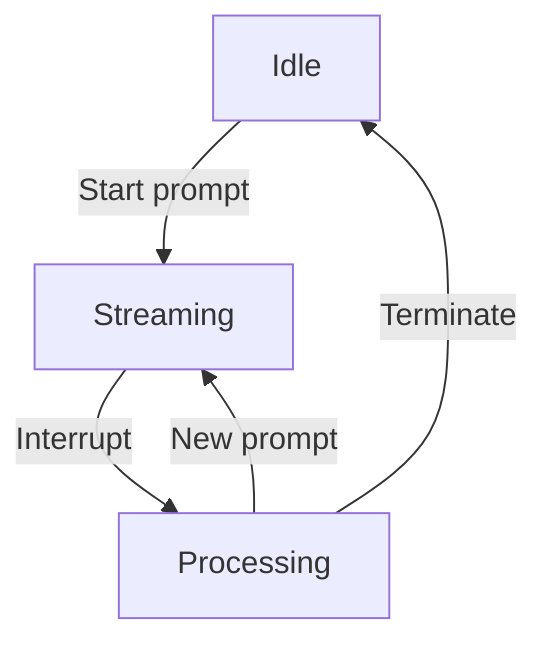

You are a senior software developer, you code like Donald Knuth.

# Task

Improve the documentation!

Refine the interrupt mechanism.

Internal interrupt generators are separate tasks that run according to a schedule (e.g. after every generated token, in every 10 seconds). They can also use LLMs to understand the recent stream, they can also access the main knowledge base and they have their own state in a separate, private knowledge base.
An interrupt - either internal or external - is a markdown document describing datetime, the interrupt source/type, last tokens of the output stream, interrupt reason and any other info relevant to the interrupt.

Think deeply and refine thoughtfully!

Do NOT create backup files.

# Output Format

Encode and enclose your results as ./change.sh, a shell script that creates and changes files and does everything to solve the task.
Avoid using sed. Always heredoc full files.

OS: Debian


Installed tools: npm, jq


EXAMPLE START
```sh
#!/bin/sh
set -e
goal=[Task description, max 9 words]
echo "Plan:"
echo "1. [...]"

# Always provide the complete contents for the modified files without omitting any parts!
cat > x.js << EOF
  let i = 1
  console.log(\`i: \${i}\`)
EOF
echo "\033[32mDone: $goal\033[0m\n"
```
EXAMPLE END

Before starting, check if you need more files or info to solve the task.

If the task is not clear:

EXAMPLE START
I need more information to solve the task. [Description of the missing info]
EXAMPLE END

Do not edit files not provided in the working set!
If you need more files:

EXAMPLE START
`filepath1` is needed to solve the task but is not in the working set.
EXAMPLE END

# Working set

README.md:
```
# StreamOfConsciousness

**StreamOfConsciousness** is an AI agent designed to maintain a persistent state in the form of a knowledge base. The knowledge base is stored as a directory structure containing Markdown files and associated metadata. Using this data store, the agent continuously executes streaming calls to Large Language Models (LLMs), generating a flowing "stream of consciousness." When an external event occurs—such as an incoming user prompt, a web API call, a tool invocation, or a periodic timeout—the ongoing stream of consciousness is interrupted, and a new set of non-streamed LLM calls determines the next prompt and resumes the stream of consciousness.

## Features

- **Stateful Knowledge Base**  
  A tree of Markdown and metadata files keeps track of the agent’s accumulated knowledge. Metadata is stored as English prose in Markdown format, following a flexible structure that can evolve over time. While default metadata configurations are provided, users can customize them by adding a configuration prompt file to their repository, allowing tailored organization and context management to suit specific project requirements.  
- **Streaming LLM Calls**  
  The AI agent generates a continuous flow of text in real-time, simulating a persistent stream of thoughts.  
- **Interrupt and Resume**  
  External events stop the current stream and trigger a short pipeline of non-streamed LLM calls to decide on the next prompt for the ongoing stream.  
- **Console and Websocket Output**  
  The stream of consciousness can be displayed in a console or streamed to a websocket for real-time updates.  
- **Web Application**  
  A complementary web interface is provided to visualize the agent’s stream and accept user inputs.

## Architecture Overview

1. **Knowledge Base (File System)**  
   - Organizes knowledge into **Abstractions** (directories) and **Atoms** (Markdown files), collectively called **Topics**.  
   - Each Abstraction contains an `index.md` with a title, description, and links to related Topics. Metadata is stored in `index.meta.md`.  
   - Atoms represent individual knowledge units with optional `<atom>.meta.md` files for metadata.  
   - The agent interacts with this structure to maintain persistent, evolving context.  

2. **LLM Streams**  
   - Continuous calls to an LLM produce a "stream of consciousness" printed to the console or sent through a websocket.  
   - When the stream is active, it represents the AI’s on-the-fly thought process, including intermediate ideas and reasoning.  

3. **Interrupt Mechanism**  
   - External triggers—user messages, API calls, or elapsed time—pause the stream.  
   - A short pipeline of non-streamed calls to an LLM decides how to respond and how to proceed with the next stream, if any.  

4. **Web Application**  
   - A web server that provides a user interface for real-time viewing of the stream and an input interface to interact with the AI.  

## Installation & Usage

1. **Installation**  
   - Ensure you have [Node.js](https://nodejs.org) installed (for the webapp and any tooling).  
   - Install any required npm packages:  
     ```bash
     npm install
     ```
   - You may also need Python or other dependencies depending on the specific LLM or integration you use.

2. **Launching the Agent**  
   - Start the system (for example, with a simple Node.js script or a Docker container if provided).  
   - Observe the continuous stream of text output in the console or via a websocket endpoint.

3. **Interacting**  
   - Use the provided web interface or direct API calls to send new prompts.  
   - On receiving a new prompt, the agent’s current stream is halted, a short decision pipeline is executed, and a new stream begins with the updated context.

## Configuration

- **LLM Provider**  
  Configure your environment variables or set up an API key for your chosen LLM provider.  
- **Timeout and Triggers**  
  Adjust thresholds for timeouts or maximum token usage to control when and how the system interrupts itself.  
- **File Storage**  
  Point the agent to a desired directory path for storing the Markdown knowledge base.

## Contributing

1. **Fork the Repo**  
   - Clone your own copy of the repository and create feature branches for your changes.  
2. **Code Guidelines**  
   - Maintain clarity in code and comments.  
   - Ensure thorough documentation and tests for new features or bug fixes.  
3. **Pull Requests**  
   - Push a branch to your fork and open a Pull Request describing your changes in detail.  
   - Project maintainers will review and merge upon approval.

## License

This project is available under the MIT License. See [LICENSE](./LICENSE) for details.

## Support

- For questions, suggestions, or issues, please open an [Issue](../../issues).  
- Feel free to submit pull requests to improve or expand functionality.

Thank you for using **StreamOfConsciousness**. We hope it enhances your AI development experience with continuous, long-term context and a truly streaming flow of thoughts!

**Note**: This project was developed using [AI Junior](https://aijunior.dev).

```
doc/architecture/llm-streams.md:
```
# LLM Stream Management

## Stream States



## Interruption Flow

1. Receive external event (user input, API call)
2. Freeze current stream context
3. Execute priority LLM pipeline:
   - Determine response strategy
   - Update knowledge base
   - Generate new prompt
4. Resume stream with new context

```
doc/index.md:
```
# StreamOfConsciousness Documentation

Welcome to the StreamOfConsciousness documentation. This resource covers everything from installation to deep architectural insights.

## Core Sections

- [Getting Started](getting-started/installation.md)
- [Configuration Guide](getting-started/configuration.md)
- [Web Interface](guides/web-interface.md)
- [System Architecture](architecture/knowledge-base.md)
- [API Reference](api/websocket.md)
- [Contributing Guide](contributing.md)

## For Different Audiences

**End Users**  
Start with [Installation](getting-started/installation.md) and [Running the Agent](getting-started/running.md).

**Developers/Integrators**  
See [Integration Guide](guides/integration.md) and [API Reference](api/websocket.md).

**Maintainers**  
Review [Architecture Overview](architecture/knowledge-base.md) and [Contributing Guide](contributing.md).

```